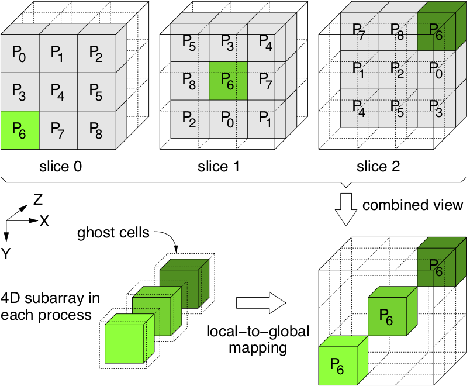

# PnetCDF I/O Benchmark using BTIO Pattern

This software benchmarks the performance of
[PnetCDF](https://parallel-netcdf.github.io) and MPI-IO methods for the I/O
pattern used by the NASA's NAS Parallel Benchmarks (NPB) suite
(http://www.nas.nasa.gov/publications/npb.html).
The evaluation method is [strong scaling](https://en.wikipedia.org/wiki/Scalability#Weak_versus_strong_scaling).

BTIO presents a block-tridiagonal partitioning pattern on a three-dimensional
array across a square number of MPI processes. Each process is responsible for
multiple Cartesian subsets of the entire data set, whose number increases with
the square root of the number of processes participating in the computation.  A
single global array with an `unlimited` dimension is created as a netCDF record
variable in the output file.  The array is of five dimensions and only
partitioned among processes along the middle three dimensions.  Each *record*
is a subarray of the least significant four dimensions.  The number of records
to write and read is user adjustable.  All records are consecutively written to
a shared file in parallel by appending one record after another.  The array
variable is stored in the file in a canonical, row-major order. To measure the
read performance, the global variable is later read back, using the same data
partitioning pattern. The size of global array can also be adjusted in the
input parameter file 'inputbt.data'. Figure 1 below shows an illustration of
data partitioning pattern for the case when the number of MPI processes is 9.
For more detailed description, please refer to:
* Wei-keng Liao. "Design and Evaluation of MPI File Domain Partitioning
  Methods under Extent-Based File Locking Protocol", in the IEEE Transactions
  on Parallel and Distributed Systems, 22(2):260-272, February 2011.


<p align="center">

</p>

**Figure 1.** BTIO data partitioning pattern, The 4D subarray in each process
is mapped to the global array in a block-tridiagonal fashion. This example uses
9 processes and highlights the mapping for process P6.

## To compile:
Edit `./Makefile` and change the following 3 variables.
```
        MPIF90        -- MPI Fortran compiler
        FCFLAGS       -- compile flag
        PNETCDF_DIR   -- path of PnetCDF library (1.4.0 and higher is required)
```
For example:
```
        MPIF90      = /usr/bin/mpif90
        FCFLAGS     = -O2
        PNETCDF_DIR = ${HOME}/PnetCDF
```
Run command `make` to build the executable, named `btio`, in the current folder.

## To run:
The input parameter file named 'inputbt.data' is required to run the benchmark.
An example is provided in the current folder and shown below. Users can adjust
the parameters in the file.
```
        w                  # IO mode: w for write, r for read
        3                  # IO method: 0 for MPI collective IO, 1 for MPI independent IO, 2 for PnetCDF blocking I/O, 3 for PnetCDF nonblocking I/O
        40                 # number of writes/reads
        512 512 512        # grid_points(1), grid_points(2), grid_points(3)
        /scratch2/scratchdirs/wkliao/FS_1M_128
```
which set
 * (first line) w is to perform write operations only
 * (second line) 3 is the I/O method to use PnetCDF nonblocking APIs
 * (third line) 40 is the number of global arrays to write to the file
 * (fourth line) 512 512 512 are the 3D global array sizes
 * (fifth line) the input/output directory name

Note that `btio` creates a file named `btio.nc` in the output directory
containing a 5D array variable named `var` of size `NUM_DUMPS x Z x Y x X x
FIVE_DBL`.  The variable's data type is an 8-byte `double precision`. The
unlimited dimension `NUM_DUMPS` corresponds to the number of record writes (or
reads for read case). The dimension sizes of global array are `Z`, `Y`, and `X`
correspond to `grid_points(3)`, `grid_points(2)`, `grid_points(1)`,
respectively. `FIVE_DBL` is the fifth dimension of size 5, which is not
partitioned among processes.

In the above example, NUM_DUMPS = 40, Z = 512, Y = 512, X = 512, and FIVE_DBL =
5. When I/O method is MPI collective I/O, there are `ncells` number of
collective I/O calls per global variable and ncells = square root of number of
MPI processes. When I/O method is MPI independent I/O, there are also `ncells`
number of independent I/O calls per global variable made by each MPI process.
When I/O method is PnetCDF blocking I/O, there are `ncells` number of
collective PnetCDF I/O calls per global variable. In this case, there are
`ncells` MPI collective I/O calls underneath PnetCDF per global variable. When
I/O method is PnetCDF nonblocking I.O, there are `ncells` number of nonblocking
PnetCDF I/O calls posted first, followed by an `nfmpi_waitall()` call to flush
the requests. In this case, there is only one MPI collective I/O calls
underneath PnetCDF per global variable.

Example command to run an MPI job:
```
        mpiexec -n 1024 ./btio
```
or
```
        mpiexec -n 1024 ./btio inputbt.data
```
The only optional command-line argument is the input parameter file name. In
this example, it is `inputbt.data`. This argument allows to use a different
input file name besides the default `inputbt.data`. If this argument is not
provided, the default is `./inputbt.data` under the current directory.

## Example output from the standard out:
```
    -- BT-IO Benchmark (write operation only) --
    Number of MPI processes  :      1024
    Global array size X      :       512
    Global array size Y      :       512
    Global array size Z      :       512
    Number of I/O iterations :        40
    Total I/O amount         :    204800.00 MiB
    Time in sec              :        41.95
    I/O bandwidth                   4882.00 MiB/s
    ------------------------------------------
    Using Parallel netCDF non-blocking I/O method
    output file path         : /scratch2/scratchdirs/wkliao/FS_1M_128
    file striping count      :       128
    file striping size       :   1048576 bytes
```

## Example metadata of the output file
A single netCDF file named `btio.nc` will be created once the run completes.
To show the file header, use the netCDF utility program `ncdump`.
```
% ncdump -h ./btio.nc

netcdf btio {
dimensions:
        FIVE_DBL = 5 ;
        X = 512 ;
        Y = 512 ;
        Z = 512 ;
        NUM_DUMPS = UNLIMITED ; // (40 currently)
variables:
        double var(NUM_DUMPS, Z, Y, X, FIVE_DBL) ;
}
```

## Questions/Comments:
email: wkliao@eecs.northwestern.edu

Copyright (C) 2013, Northwestern University.

See COPYRIGHT notice in top-level directory.

